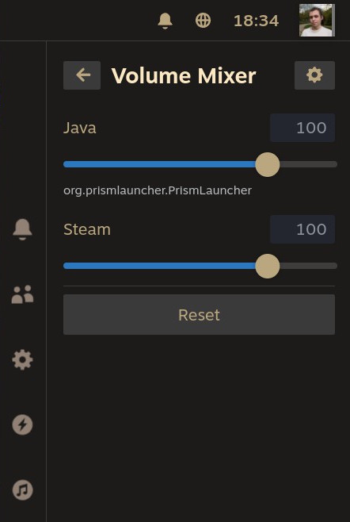
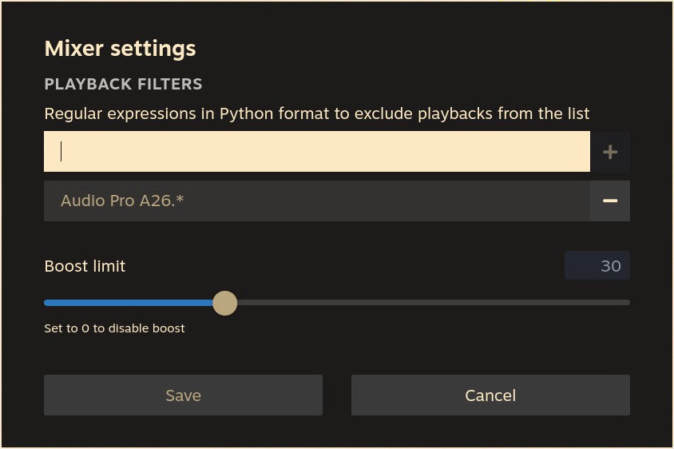

## decky-volume-mixer

Control the volume of individual applications directly from game mode using Pipewire.

### Features

- **Per-app volume control** — adjust the volume of each running application independently
- **Pipewire integration** — works natively with Pipewire via `pw-dump` and `wpctl`
- **Configurable** — tweak plugin behavior through the settings panel

### Build

```sh
make       # install deps, build, and package into build/decky-volume-mixer.zip
make build # install deps and build without packaging
make clean # remove dist and build directories
```

### Screenshots

| Main View | Settings |
|:---------:|:--------:|
|  |  |
